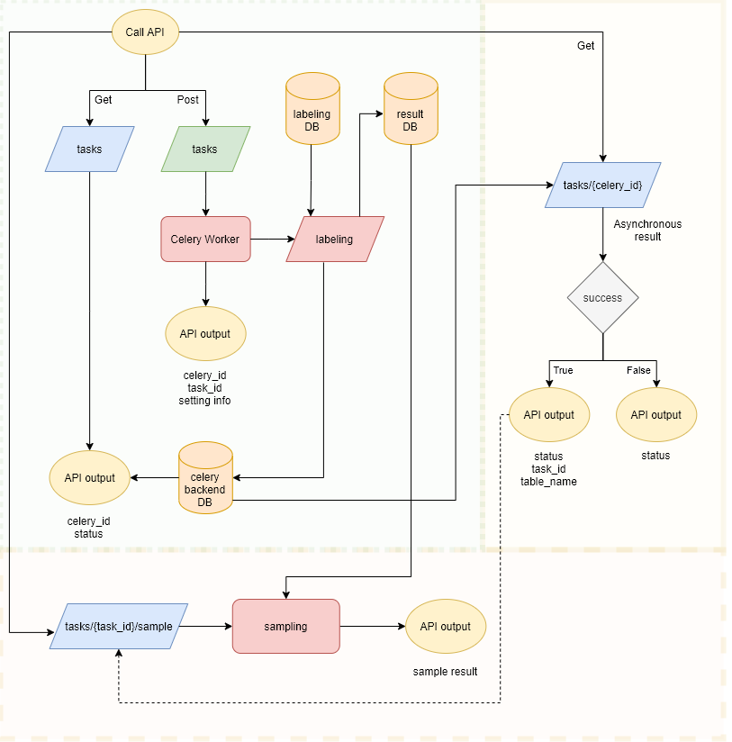

# Audience API

###### created by Weber Huang at 2021-10-07

+ [Description](#description)
+ [Work Flow](#work-flow)
+ [Built With](#built-with)
+ [Quick Start](#quick-start)
  + [Set up docker](#set-up-docker)
  + [Set up environment](#set-up-environment)
  + [Set up database information](#set-up-database-information)
  + [Initialize the worker](#initialize-the-worker)
  + [Run the API](#run-the-api)

## Description

This API is built for data labeling task which support the Analysis Department.

The main functions of the API: 

+ It let users to input the query parameters to query from the database to scrap out data 
+ support executing the background labeling task
+ let user to check the status via task id
+ show the labeling result sample

## Work Flow



## Built With

Windows 10

Python 3.8

Celery 5.1.2

FastAPI 0.68.1

SQLModel 0.04

## Quick Start

#### Set up docker

If you are already using docker, skip this part.

Before starting this project, we assume users have downloaded docker. About how to use docker, users may refer to [Docker Guides](https://docs.docker.com/get-started/).

#### Set up environment

Download docker version of *Redis* beforehand

```bash
$ docker run -d -p 6379:6379 redis
```

Get into the virtual environment

```bash
$ cd <your project dir>
$ pip install virtualenv

# Setup virtual environment
$ virtualenv venv

# Activate environment
$ venv\Scripts\activate
```

Install packages

```bash
$ pip install -r requirements.txt
```

#### Set up database information

Set the environment variable in your project root directory. Use text editor to create a file with some important info inside:

```bash
HOST=<database host>
PORT=<database port>
USER=<database username>
PASSWORD=<database password>
INPUT_SCHEMA=<database schema>
OUTPUT_SCHEMA=<database schema>
```

Replace the value from your own, and save the file as `.env`

#### Initialize the worker

###### Run the worker

Make sure the redis is running beforehand or you should fail to initialize celery

```
$ celery -A celery_worker worker -l INFO -P solo


 -------------- celery@nuc373 v5.1.2 (sun-harmonics)
--- ***** -----
-- ******* ---- Windows-10-10.0.19042-SP0 2021-10-07 13:46:16
- *** --- * ---
- ** ---------- [config]
- ** ---------- .> app:         __main__:0x27ed0212580
- ** ---------- .> transport:   redis://localhost:6379//
- ** ---------- .> results:     redis://localhost/0
- *** --- * --- .> concurrency: 8 (solo)
-- ******* ---- .> task events: OFF (enable -E to monitor tasks in this worker)
--- ***** -----
 -------------- [queues]
                .> celery           exchange=celery(direct) key=celery


[tasks]
  . celery_worker.label_data


[2021-10-07 13:46:44,686: INFO/MainProcess] Connected to redis://localhost:6379//
[2021-10-07 13:46:44,718: INFO/MainProcess] mingle: searching for neighbors
[2021-10-07 13:46:45,797: INFO/MainProcess] mingle: all alone
[2021-10-07 13:46:45,838: INFO/MainProcess] celery@nuc373 ready.

```

#### Run the API

```bash
$ python label_api.py

INFO:     Started server process [16116]
INFO:     Waiting for application startup.
INFO:     Application startup complete.
INFO:     Uvicorn running on http://127.0.0.1:8000 (Press CTRL+C to quit)
```

Open the link http://127.0.0.1:8000/docs to use the OpenAPI UI


