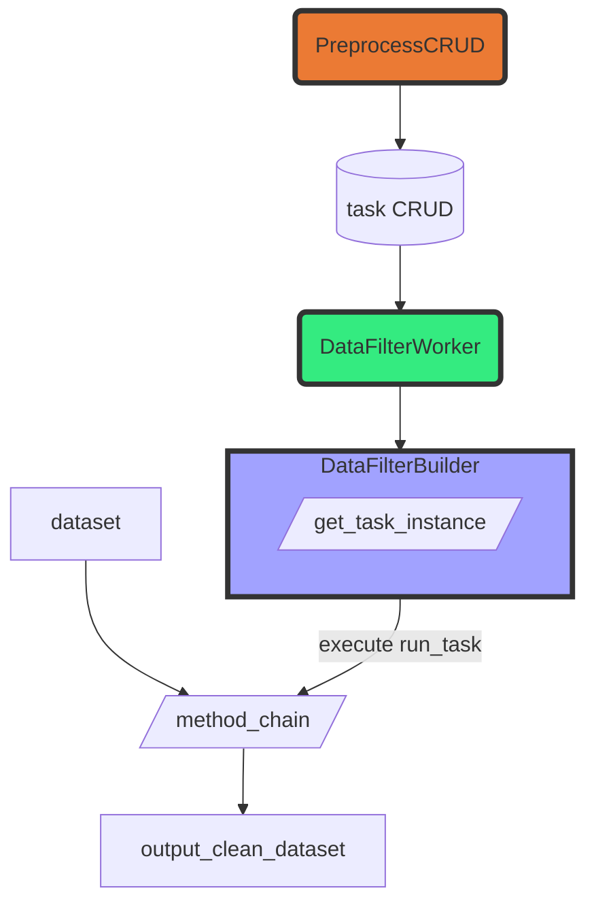

## 需求

因應 AS1 提出需求，為了解決模型或貼標任務結果包含雜訊內容，開發前處理模組。

###### 功能描述 :

應用**關鍵字模型**、**正則表達式**模型，開發能<u>修改或排除</u>特定內容的的模組，能被應用於模型任務與貼標任務開始前先執行該模組功能。


## 開發流程

#### 開發項目

針對需求開發 `DataFilterWorker`, `DataFilterBuilder` and `PreprocessCRUD` 以及preprocess API

###### 功能

`PreprocessCRUD` 負責前處理模組任務和規則資料庫操作

`DataFilterWorker` 執行前處理模組任務

`DataFilterBuilder` 串接前處理模組任務與模型任務與貼標任務

###### API

`/preprocess/create_task/` 建立前處理任務

`/preprocess/{task_id}/upload_rules` 針對特定任務上傳規則，覆寫舊任務規則內容

`/preprocess/delete_task/` 刪除任務

`/preprocess/{task_id}/update_task` 更新任務


#### 開發流程

1. 前處理模組需要用到的後端儲存系統

   ```mermaid
   erDiagram
   filter-rule-task ||--|{ filter-rules : contain
   filter-rule-task {
   int id
   string name
   string feature
   string model_name
   datetime create_time 
   longtext error_message
   }
   filter-rules {
   int id
   string content
   string rule_type
   string label
   string match_type
   }
   ```


2. 前處理模組流程



